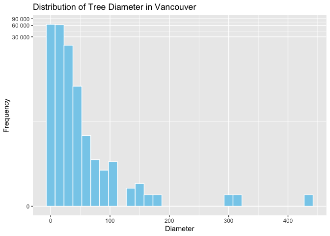
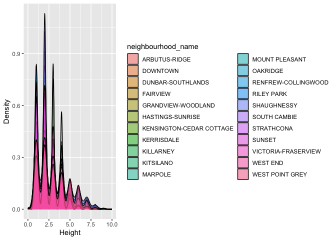
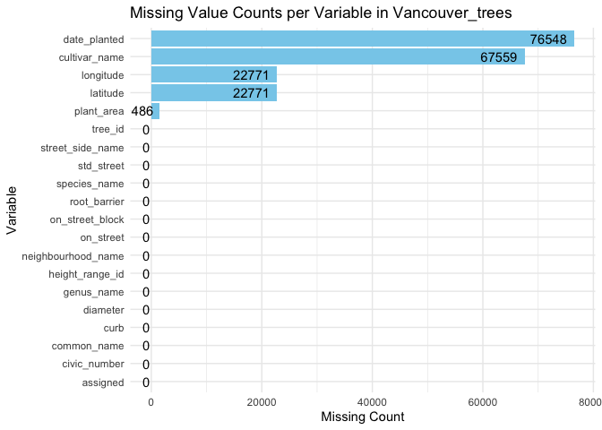
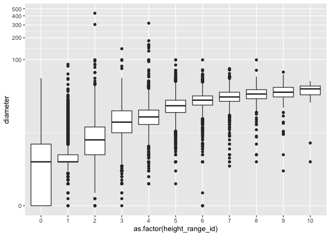

# Welcome to your (maybe) first-ever data analysis project!

And hopefully the first of many. Let’s get started:

1.  Install the [`datateachr`](https://github.com/UBC-MDS/datateachr)
    package by typing the following into your **R terminal**:

<!-- -->

    install.packages("devtools")
    devtools::install_github("UBC-MDS/datateachr")

1.  Load the packages below.

``` r
library(datateachr)
library(tidyverse)
```

    ## ── Attaching core tidyverse packages ──────────────────────── tidyverse 2.0.0 ──
    ## ✔ dplyr     1.1.3     ✔ readr     2.1.4
    ## ✔ forcats   1.0.0     ✔ stringr   1.5.0
    ## ✔ ggplot2   3.4.3     ✔ tibble    3.2.1
    ## ✔ lubridate 1.9.2     ✔ tidyr     1.3.0
    ## ✔ purrr     1.0.2     
    ## ── Conflicts ────────────────────────────────────────── tidyverse_conflicts() ──
    ## ✖ dplyr::filter() masks stats::filter()
    ## ✖ dplyr::lag()    masks stats::lag()
    ## ℹ Use the conflicted package (<http://conflicted.r-lib.org/>) to force all conflicts to become errors

1.  Make a repository in the <https://github.com/stat545ubc-2023>
    Organization. You can do this by following the steps found on canvas
    in the entry called [MDA: Create a
    repository](https://canvas.ubc.ca/courses/126199/pages/mda-create-a-repository).
    One completed, your repository should automatically be listed as
    part of the stat545ubc-2023 Organization.

# Instructions

## For Both Milestones

-   Each milestone has explicit tasks. Tasks that are more challenging
    will often be allocated more points.

-   Each milestone will be also graded for reproducibility, cleanliness,
    and coherence of the overall Github submission.

-   While the two milestones will be submitted as independent
    deliverables, the analysis itself is a continuum - think of it as
    two chapters to a story. Each chapter, or in this case, portion of
    your analysis, should be easily followed through by someone
    unfamiliar with the content.
    [Here](https://swcarpentry.github.io/r-novice-inflammation/06-best-practices-R/)
    is a good resource for what constitutes “good code”. Learning good
    coding practices early in your career will save you hassle later on!

-   The milestones will be equally weighted.

## For Milestone 1

**To complete this milestone**, edit [this very `.Rmd`
file](https://raw.githubusercontent.com/UBC-STAT/stat545.stat.ubc.ca/master/content/mini-project/mini-project-1.Rmd)
directly. Fill in the sections that are tagged with
`<!--- start your work below --->`.

**To submit this milestone**, make sure to knit this `.Rmd` file to an
`.md` file by changing the YAML output settings from
`output: html_document` to `output: github_document`. Commit and push
all of your work to the mini-analysis GitHub repository you made
earlier, and tag a release on GitHub. Then, submit a link to your tagged
release on canvas.

**Points**: This milestone is worth 36 points: 30 for your analysis, and
6 for overall reproducibility, cleanliness, and coherence of the Github
submission.

# Learning Objectives

By the end of this milestone, you should:

-   Become familiar with your dataset of choosing
-   Select 4 questions that you would like to answer with your data
-   Generate a reproducible and clear report using R Markdown
-   Become familiar with manipulating and summarizing your data in
    tibbles using `dplyr`, with a research question in mind.

# Task 1: Choose your favorite dataset

The `datateachr` package by Hayley Boyce and Jordan Bourak currently
composed of 7 semi-tidy datasets for educational purposes. Here is a
brief description of each dataset:

-   *apt_buildings*: Acquired courtesy of The City of Toronto’s Open
    Data Portal. It currently has 3455 rows and 37 columns.

-   *building_permits*: Acquired courtesy of The City of Vancouver’s
    Open Data Portal. It currently has 20680 rows and 14 columns.

-   *cancer_sample*: Acquired courtesy of UCI Machine Learning
    Repository. It currently has 569 rows and 32 columns.

-   *flow_sample*: Acquired courtesy of The Government of Canada’s
    Historical Hydrometric Database. It currently has 218 rows and 7
    columns.

-   *parking_meters*: Acquired courtesy of The City of Vancouver’s Open
    Data Portal. It currently has 10032 rows and 22 columns.

-   *steam_games*: Acquired courtesy of Kaggle. It currently has 40833
    rows and 21 columns.

-   *vancouver_trees*: Acquired courtesy of The City of Vancouver’s Open
    Data Portal. It currently has 146611 rows and 20 columns.

**Things to keep in mind**

-   We hope that this project will serve as practice for carrying our
    your own *independent* data analysis. Remember to comment your code,
    be explicit about what you are doing, and write notes in this
    markdown document when you feel that context is required. As you
    advance in the project, prompts and hints to do this will be
    diminished - it’ll be up to you!

-   Before choosing a dataset, you should always keep in mind **your
    goal**, or in other ways, *what you wish to achieve with this data*.
    This mini data-analysis project focuses on *data wrangling*,
    *tidying*, and *visualization*. In short, it’s a way for you to get
    your feet wet with exploring data on your own.

And that is exactly the first thing that you will do!

1.1 **(1 point)** Out of the 7 datasets available in the `datateachr`
package, choose **4** that appeal to you based on their description.
Write your choices below:

**Note**: We encourage you to use the ones in the `datateachr` package,
but if you have a dataset that you’d really like to use, you can include
it here. But, please check with a member of the teaching team to see
whether the dataset is of appropriate complexity. Also, include a
**brief** description of the dataset here to help the teaching team
understand your data.

<!-------------------------- Start your work below ---------------------------->

1: CHOICE_1\_permits  
2: CHOICE_2\_meters  
3: CHOICE_3\_trees  
4: CHOICE_4\_games

<!----------------------------------------------------------------------------->

1.2 **(6 points)** One way to narrowing down your selection is to
*explore* the datasets. Use your knowledge of dplyr to find out at least
*3* attributes about each of these datasets (an attribute is something
such as number of rows, variables, class type…). The goal here is to
have an idea of *what the data looks like*.

*Hint:* This is one of those times when you should think about the
cleanliness of your analysis. I added a single code chunk for you below,
but do you want to use more than one? Would you like to write more
comments outside of the code chunk?

<!-------------------------- Start your work below ---------------------------->

``` r
### EXPLORE HERE ###
# building_permits
nrow(building_permits)
```

    ## [1] 20680

``` r
ncol(building_permits)
```

    ## [1] 14

``` r
names(building_permits)
```

    ##  [1] "permit_number"               "issue_date"                 
    ##  [3] "project_value"               "type_of_work"               
    ##  [5] "address"                     "project_description"        
    ##  [7] "building_contractor"         "building_contractor_address"
    ##  [9] "applicant"                   "applicant_address"          
    ## [11] "property_use"                "specific_use_category"      
    ## [13] "year"                        "bi_id"

``` r
class(building_permits)
```

    ## [1] "spec_tbl_df" "tbl_df"      "tbl"         "data.frame"

``` r
head(building_permits)
```

    ## # A tibble: 6 × 14
    ##   permit_number issue_date project_value type_of_work          address          
    ##   <chr>         <date>             <dbl> <chr>                 <chr>            
    ## 1 BP-2016-02248 2017-02-01             0 Salvage and Abatement 4378 W 9TH AVENU…
    ## 2 BU468090      2017-02-01             0 New Building          1111 RICHARDS ST…
    ## 3 DB-2016-04450 2017-02-01         35000 Addition / Alteration 3732 W 12TH AVEN…
    ## 4 DB-2017-00131 2017-02-01         15000 Addition / Alteration 88 W PENDER STRE…
    ## 5 DB452250      2017-02-01        181178 New Building          492 E 62ND AVENU…
    ## 6 BP-2016-01458 2017-02-02             0 Salvage and Abatement 3332 W 28TH AVEN…
    ## # ℹ 9 more variables: project_description <chr>, building_contractor <chr>,
    ## #   building_contractor_address <chr>, applicant <chr>,
    ## #   applicant_address <chr>, property_use <chr>, specific_use_category <chr>,
    ## #   year <dbl>, bi_id <dbl>

``` r
# parking_meters
nrow(parking_meters)
```

    ## [1] 10032

``` r
ncol(parking_meters)
```

    ## [1] 22

``` r
names(parking_meters)
```

    ##  [1] "meter_head"     "r_mf_9a_6p"     "r_mf_6p_10"     "r_sa_9a_6p"    
    ##  [5] "r_sa_6p_10"     "r_su_9a_6p"     "r_su_6p_10"     "rate_misc"     
    ##  [9] "time_in_effect" "t_mf_9a_6p"     "t_mf_6p_10"     "t_sa_9a_6p"    
    ## [13] "t_sa_6p_10"     "t_su_9a_6p"     "t_su_6p_10"     "time_misc"     
    ## [17] "credit_card"    "pay_phone"      "longitude"      "latitude"      
    ## [21] "geo_local_area" "meter_id"

``` r
class(parking_meters)
```

    ## [1] "tbl_df"     "tbl"        "data.frame"

``` r
head(parking_meters)
```

    ## # A tibble: 6 × 22
    ##   meter_head  r_mf_9a_6p r_mf_6p_10 r_sa_9a_6p r_sa_6p_10 r_su_9a_6p r_su_6p_10
    ##   <chr>       <chr>      <chr>      <chr>      <chr>      <chr>      <chr>     
    ## 1 Twin        $2.00      $4.00      $2.00      $4.00      $2.00      $4.00     
    ## 2 Pay Station $1.00      $1.00      $1.00      $1.00      $1.00      $1.00     
    ## 3 Twin        $1.00      $1.00      $1.00      $1.00      $1.00      $1.00     
    ## 4 Single      $1.00      $1.00      $1.00      $1.00      $1.00      $1.00     
    ## 5 Twin        $2.00      $1.00      $2.00      $1.00      $2.00      $1.00     
    ## 6 Twin        $2.00      $1.00      $2.00      $1.00      $2.00      $1.00     
    ## # ℹ 15 more variables: rate_misc <chr>, time_in_effect <chr>, t_mf_9a_6p <chr>,
    ## #   t_mf_6p_10 <chr>, t_sa_9a_6p <chr>, t_sa_6p_10 <chr>, t_su_9a_6p <chr>,
    ## #   t_su_6p_10 <chr>, time_misc <chr>, credit_card <chr>, pay_phone <chr>,
    ## #   longitude <dbl>, latitude <dbl>, geo_local_area <chr>, meter_id <chr>

``` r
# vancouver_trees
nrow(vancouver_trees)
```

    ## [1] 146611

``` r
ncol(vancouver_trees)
```

    ## [1] 20

``` r
names(vancouver_trees)
```

    ##  [1] "tree_id"            "civic_number"       "std_street"        
    ##  [4] "genus_name"         "species_name"       "cultivar_name"     
    ##  [7] "common_name"        "assigned"           "root_barrier"      
    ## [10] "plant_area"         "on_street_block"    "on_street"         
    ## [13] "neighbourhood_name" "street_side_name"   "height_range_id"   
    ## [16] "diameter"           "curb"               "date_planted"      
    ## [19] "longitude"          "latitude"

``` r
class(vancouver_trees)
```

    ## [1] "tbl_df"     "tbl"        "data.frame"

``` r
head(vancouver_trees)
```

    ## # A tibble: 6 × 20
    ##   tree_id civic_number std_street genus_name species_name cultivar_name  
    ##     <dbl>        <dbl> <chr>      <chr>      <chr>        <chr>          
    ## 1  149556          494 W 58TH AV  ULMUS      AMERICANA    BRANDON        
    ## 2  149563          450 W 58TH AV  ZELKOVA    SERRATA      <NA>           
    ## 3  149579         4994 WINDSOR ST STYRAX     JAPONICA     <NA>           
    ## 4  149590          858 E 39TH AV  FRAXINUS   AMERICANA    AUTUMN APPLAUSE
    ## 5  149604         5032 WINDSOR ST ACER       CAMPESTRE    <NA>           
    ## 6  149616          585 W 61ST AV  PYRUS      CALLERYANA   CHANTICLEER    
    ## # ℹ 14 more variables: common_name <chr>, assigned <chr>, root_barrier <chr>,
    ## #   plant_area <chr>, on_street_block <dbl>, on_street <chr>,
    ## #   neighbourhood_name <chr>, street_side_name <chr>, height_range_id <dbl>,
    ## #   diameter <dbl>, curb <chr>, date_planted <date>, longitude <dbl>,
    ## #   latitude <dbl>

``` r
# steam_games
nrow(steam_games)
```

    ## [1] 40833

``` r
ncol(steam_games)
```

    ## [1] 21

``` r
names(steam_games)
```

    ##  [1] "id"                       "url"                     
    ##  [3] "types"                    "name"                    
    ##  [5] "desc_snippet"             "recent_reviews"          
    ##  [7] "all_reviews"              "release_date"            
    ##  [9] "developer"                "publisher"               
    ## [11] "popular_tags"             "game_details"            
    ## [13] "languages"                "achievements"            
    ## [15] "genre"                    "game_description"        
    ## [17] "mature_content"           "minimum_requirements"    
    ## [19] "recommended_requirements" "original_price"          
    ## [21] "discount_price"

``` r
class(steam_games)
```

    ## [1] "spec_tbl_df" "tbl_df"      "tbl"         "data.frame"

``` r
head(steam_games)
```

    ## # A tibble: 6 × 21
    ##      id url     types name  desc_snippet recent_reviews all_reviews release_date
    ##   <dbl> <chr>   <chr> <chr> <chr>        <chr>          <chr>       <chr>       
    ## 1     1 https:… app   DOOM  Now include… Very Positive… Very Posit… May 12, 2016
    ## 2     2 https:… app   PLAY… PLAYERUNKNO… Mixed,(6,214)… Mixed,(836… Dec 21, 2017
    ## 3     3 https:… app   BATT… Take comman… Mixed,(166),-… Mostly Pos… Apr 24, 2018
    ## 4     4 https:… app   DayZ  The post-so… Mixed,(932),-… Mixed,(167… Dec 13, 2018
    ## 5     5 https:… app   EVE … EVE Online … Mixed,(287),-… Mostly Pos… May 6, 2003 
    ## 6     6 https:… bund… Gran… Grand Theft… NaN            NaN         NaN         
    ## # ℹ 13 more variables: developer <chr>, publisher <chr>, popular_tags <chr>,
    ## #   game_details <chr>, languages <chr>, achievements <dbl>, genre <chr>,
    ## #   game_description <chr>, mature_content <chr>, minimum_requirements <chr>,
    ## #   recommended_requirements <chr>, original_price <dbl>, discount_price <dbl>

<!----------------------------------------------------------------------------->

1.3 **(1 point)** Now that you’ve explored the 4 datasets that you were
initially most interested in, let’s narrow it down to 1. What lead you
to choose this one? Briefly explain your choice below.

<!-------------------------- Start your work below ---------------------------->

I will select the *vancouver_trees* dataset for the following reasons:

1.  It contains numerous numeric values that can be effectively utilized
    for algorithmic operations during data analysis.

2.  Unlike other datasets that may contain random strings, this dataset
    features many variables with categorical values that can be used for
    grouping in data analysis.

3.  In contrast to other datasets, the Vancouver Trees dataset includes
    the coordinates of the trees, which can be employed for
    visualization purposes.

4.  It doesn’t contain many **NA** values in the dataset
    <!----------------------------------------------------------------------------->

1.4 **(2 points)** Time for a final decision! Going back to the
beginning, it’s important to have an *end goal* in mind. For example, if
I had chosen the `titanic` dataset for my project, I might’ve wanted to
explore the relationship between survival and other variables. Try to
think of 1 research question that you would want to answer with your
dataset. Note it down below.

<!-------------------------- Start your work below ---------------------------->

The relationship between common tree species and the neighborhoods that
planted them in Vancouver.
<!----------------------------------------------------------------------------->

# Important note

Read Tasks 2 and 3 *fully* before starting to complete either of them.
Probably also a good point to grab a coffee to get ready for the fun
part!

This project is semi-guided, but meant to be *independent*. For this
reason, you will complete tasks 2 and 3 below (under the **START HERE**
mark) as if you were writing your own exploratory data analysis report,
and this guidance never existed! Feel free to add a brief introduction
section to your project, format the document with markdown syntax as you
deem appropriate, and structure the analysis as you deem appropriate. If
you feel lost, you can find a sample data analysis
[here](https://www.kaggle.com/headsortails/tidy-titarnic) to have a
better idea. However, bear in mind that it is **just an example** and
you will not be required to have that level of complexity in your
project.

# Task 2: Exploring your dataset

If we rewind and go back to the learning objectives, you’ll see that by
the end of this deliverable, you should have formulated *4* research
questions about your data that you may want to answer during your
project. However, it may be handy to do some more exploration on your
dataset of choice before creating these questions - by looking at the
data, you may get more ideas. **Before you start this task, read all
instructions carefully until you reach START HERE under Task 3**.

2.1 **(12 points)** Complete *4 out of the following 8 exercises* to
dive deeper into your data. All datasets are different and therefore,
not all of these tasks may make sense for your data - which is why you
should only answer *4*.

Make sure that you’re using dplyr and ggplot2 rather than base R for
this task. Outside of this project, you may find that you prefer using
base R functions for certain tasks, and that’s just fine! But part of
this project is for you to practice the tools we learned in class, which
is dplyr and ggplot2.

1.  Plot the distribution of a numeric variable.
2.  Create a new variable based on other variables in your data (only if
    it makes sense)
3.  Investigate how many missing values there are per variable. Can you
    find a way to plot this?
4.  Explore the relationship between 2 variables in a plot.
5.  Filter observations in your data according to your own criteria.
    Think of what you’d like to explore - again, if this was the
    `titanic` dataset, I may want to narrow my search down to passengers
    born in a particular year…
6.  Use a boxplot to look at the frequency of different observations
    within a single variable. You can do this for more than one variable
    if you wish!
7.  Make a new tibble with a subset of your data, with variables and
    observations that you are interested in exploring.
8.  Use a density plot to explore any of your variables (that are
    suitable for this type of plot).

2.2 **(4 points)** For each of the 4 exercises that you complete,
provide a *brief explanation* of why you chose that exercise in relation
to your data (in other words, why does it make sense to do that?), and
sufficient comments for a reader to understand your reasoning and code.

<!-------------------------- Start your work below ---------------------------->

### Response to question 1 -\> Distribution of Tree Diameter in Vancouver

It is interested to me to know the diameter distribution of trees in
Vancouver. Since we could use power of data to influence the decision of
cutting trees when make urban plannings. As we can see from the final
result most trees have a diameter less than 50 inches. Trees with larger
diameter deserve more attention from us.

``` r
cleaned_data <- vancouver_trees %>%
  filter(!is.na(diameter), diameter > 0)

distribution_plot <- cleaned_data %>%
  ggplot(aes(x = diameter)) +
  geom_histogram(fill = "skyblue", color = "white", bins = 30, position = "identity") +
  labs(
    title = "Distribution of Tree Diameter in Vancouver",
    x = "Diameter",
    y = "Frequency"
  ) +
  scale_y_continuous(labels = scales::number_format(scale = 1e0), trans = 'log1p')

# Print the plot
print(distribution_plot)
```



### Response to Question 8 -\> Use density_plot to explore the height range of vancouver trees in different neighourhood

A density plot serves as an effective method for visualizing tree
heights across various neighborhoods. Employing this approach provides
us with insight into the distribution of trees within different
neighborhoods. Using a density plot is a valuable approach because it
provides a clear and informative visualization of tree height
distributions across neighborhoods, aiding in the interpretation of
spatial patterns and trends in urban forestry and environmental
analysis.

``` r
density_plot <- ggplot(vancouver_trees, aes(x = height_range_id, fill = neighbourhood_name)) +
  geom_density(alpha = 0.5) +
  labs(x = "Height", y = "Density")

print(density_plot)
```



### Response to question 3

Many of the variable in vancouer_trees tibble are numerical, it will
benefit us beform doing algorithmic operations on the variable. We will
take cautions on dealing with NA values

``` r
missing_counts <- vancouver_trees %>%
  summarise(across(everything(), ~sum(is.na(.))))

# Convert the result into a data frame (optional)
missing_counts_df <- as.data.frame(missing_counts)

# Create a ggplot bar plot to visualize missing value counts
missing_plot <- missing_counts_df %>%
  pivot_longer(everything(), names_to = "Variable", values_to = "Missing_Count") %>%
  ggplot(aes(x = reorder(Variable, Missing_Count), y = Missing_Count)) +
  geom_bar(stat = "identity", fill = "skyblue") +
  geom_text(aes(label = Missing_Count), vjust = 0.5, hjust = 1.2) +
  labs(
    title = "Missing Value Counts per Variable in Vancouver_trees",
    x = "Variable",
    y = "Missing Count"
  ) +
  theme_minimal() +
  coord_flip()  # Rotate the x-axis labels for better readability

# Print the plot
print(missing_plot)
```



### Response to Question 6: Investigate the correlation between “height_range_id” and “diameter” to determine if there is a relationship between them.

Based on the data schema provided for Vancouver Trees, the variable
“height_range_id” represents height ranges in increments of 10 feet. For
instance, a value of 0 corresponds to trees with heights between 0 and
10 feet, a value of 1 represents trees with heights between 10 and 20
feet, and so on, with 10 representing trees that are 100 feet or taller.

I find it intriguing to explore whether there is a positive correlation
between tree height and diameter. To investigate this relationship, I
chose to visualize the data using a box plot. A box plot is particularly
useful when dealing with a large dataset, as it provides a clear summary
of the data distribution within each height range bin. This
visualization allows us to easily observe key statistics such as the
median and mean diameter values for trees in each height range,
facilitating meaningful comparisons between the height categories.

``` r
relation_plot <- vancouver_trees %>%
  ggplot(aes(x = as.factor(height_range_id), y = diameter)) +  
  geom_boxplot() +  
  scale_x_discrete() +
  scale_y_continuous(trans = 'log1p')

print(relation_plot)
```



<!----------------------------------------------------------------------------->

# Task 3: Choose research questions

**(4 points)** So far, you have chosen a dataset and gotten familiar
with it through exploring the data. You have also brainstormed one
research question that interested you (Task 1.4). Now it’s time to pick
4 research questions that you would like to explore in Milestone 2!
Write the 4 questions and any additional comments below.

<!--- *****START HERE***** --->

1.  Investigate the relationship between the height and diameter of
    trees in Vancouver by examining the correlation. To do this, we will
    make direct reference to the “height_range_id” as provided in the
    data source, which corresponds to tree height in inches.

2.  Analyze the historical trends in tree planting within Vancouver over
    the years. We will utilize the “date_planted” variable to visualize
    and chart the patterns of tree planting.

3.  Explore the correlation between tree species and neighborhoods in
    Vancouver. This analysis will involve examining the relationship
    between the types of trees, as indicated by the “species_name”
    variable, and the specific neighborhoods, as indicated by the
    “neighborhood_name” variable. We aim to determine whether different
    tree species preferences exist across various neighborhoods.

4.  Determine the distribution of tree species planted in Vancouver. We
    will assess the dataset to ascertain the number of trees belonging
    to each species category that have been planted within the city.

<!----------------------------->

# Overall reproducibility/Cleanliness/Coherence Checklist

## Coherence (0.5 points)

The document should read sensibly from top to bottom, with no major
continuity errors. An example of a major continuity error is having a
data set listed for Task 3 that is not part of one of the data sets
listed in Task 1.

## Error-free code (3 points)

For full marks, all code in the document should run without error. 1
point deduction if most code runs without error, and 2 points deduction
if more than 50% of the code throws an error.

## Main README (1 point)

There should be a file named `README.md` at the top level of your
repository. Its contents should automatically appear when you visit the
repository on GitHub.

Minimum contents of the README file:

-   In a sentence or two, explains what this repository is, so that
    future-you or someone else stumbling on your repository can be
    oriented to the repository.
-   In a sentence or two (or more??), briefly explains how to engage
    with the repository. You can assume the person reading knows the
    material from STAT 545A. Basically, if a visitor to your repository
    wants to explore your project, what should they know?

Once you get in the habit of making README files, and seeing more README
files in other projects, you’ll wonder how you ever got by without them!
They are tremendously helpful.

## Output (1 point)

All output is readable, recent and relevant:

-   All Rmd files have been `knit`ted to their output md files.
-   All knitted md files are viewable without errors on Github. Examples
    of errors: Missing plots, “Sorry about that, but we can’t show files
    that are this big right now” messages, error messages from broken R
    code
-   All of these output files are up-to-date – that is, they haven’t
    fallen behind after the source (Rmd) files have been updated.
-   There should be no relic output files. For example, if you were
    knitting an Rmd to html, but then changed the output to be only a
    markdown file, then the html file is a relic and should be deleted.

(0.5 point deduction if any of the above criteria are not met. 1 point
deduction if most or all of the above criteria are not met.)

Our recommendation: right before submission, delete all output files,
and re-knit each milestone’s Rmd file, so that everything is up to date
and relevant. Then, after your final commit and push to Github, CHECK on
Github to make sure that everything looks the way you intended!

## Tagged release (0.5 points)

You’ve tagged a release for Milestone 1.

### Attribution

Thanks to Icíar Fernández Boyano for mostly putting this together, and
Vincenzo Coia for launching.
