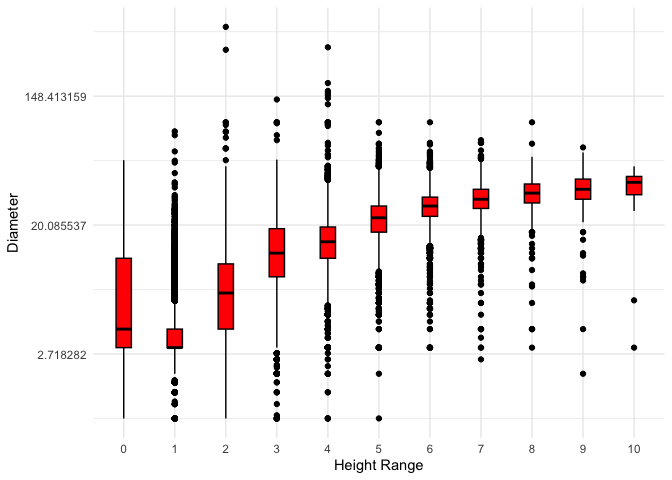
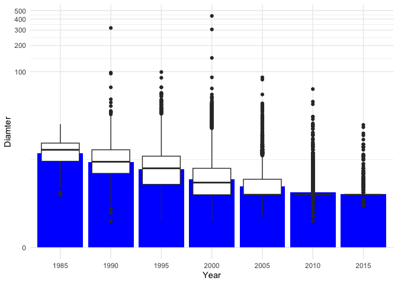
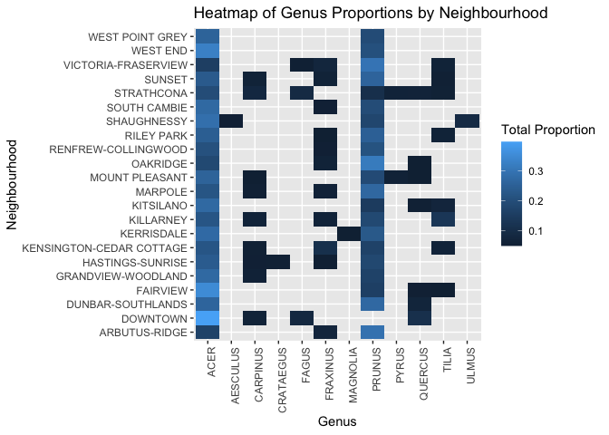
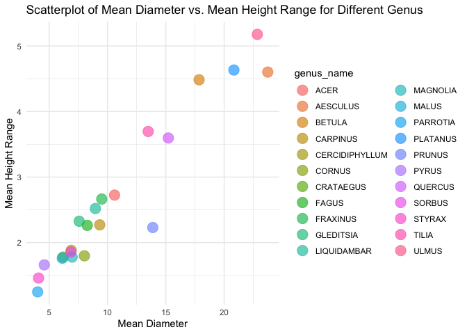

Mini Data Analysis Milestone 2
================

*To complete this milestone, you can either edit [this `.rmd`
file](https://raw.githubusercontent.com/UBC-STAT/stat545.stat.ubc.ca/master/content/mini-project/mini-project-2.Rmd)
directly. Fill in the sections that are commented out with
`<!--- start your work here--->`. When you are done, make sure to knit
to an `.md` file by changing the output in the YAML header to
`github_document`, before submitting a tagged release on canvas.*

# Welcome to the rest of your mini data analysis project!

In Milestone 1, you explored your data. and came up with research
questions. This time, we will finish up our mini data analysis and
obtain results for your data by:

- Making summary tables and graphs
- Manipulating special data types in R: factors and/or dates and times.
- Fitting a model object to your data, and extract a result.
- Reading and writing data as separate files.

We will also explore more in depth the concept of *tidy data.*

**NOTE**: The main purpose of the mini data analysis is to integrate
what you learn in class in an analysis. Although each milestone provides
a framework for you to conduct your analysis, it’s possible that you
might find the instructions too rigid for your data set. If this is the
case, you may deviate from the instructions – just make sure you’re
demonstrating a wide range of tools and techniques taught in this class.

# Instructions

**To complete this milestone**, edit [this very `.Rmd`
file](https://raw.githubusercontent.com/UBC-STAT/stat545.stat.ubc.ca/master/content/mini-project/mini-project-2.Rmd)
directly. Fill in the sections that are tagged with
`<!--- start your work here--->`.

**To submit this milestone**, make sure to knit this `.Rmd` file to an
`.md` file by changing the YAML output settings from
`output: html_document` to `output: github_document`. Commit and push
all of your work to your mini-analysis GitHub repository, and tag a
release on GitHub. Then, submit a link to your tagged release on canvas.

**Points**: This milestone is worth 50 points: 45 for your analysis, and
5 for overall reproducibility, cleanliness, and coherence of the Github
submission.

**Research Questions**: In Milestone 1, you chose two research questions
to focus on. Wherever realistic, your work in this milestone should
relate to these research questions whenever we ask for justification
behind your work. In the case that some tasks in this milestone don’t
align well with one of your research questions, feel free to discuss
your results in the context of a different research question.

# Learning Objectives

By the end of this milestone, you should:

- Understand what *tidy* data is, and how to create it using `tidyr`.
- Generate a reproducible and clear report using R Markdown.
- Manipulating special data types in R: factors and/or dates and times.
- Fitting a model object to your data, and extract a result.
- Reading and writing data as separate files.

# Setup

Begin by loading your data and the tidyverse package below:

``` r
library(datateachr) # <- might contain the data you picked!
library(tidyverse)
```

# Task 1: Process and summarize your data

From milestone 1, you should have an idea of the basic structure of your
dataset (e.g. number of rows and columns, class types, etc.). Here, we
will start investigating your data more in-depth using various data
manipulation functions.

### 1.1 (1 point)

First, write out the 4 research questions you defined in milestone 1
were. This will guide your work through milestone 2:

<!-------------------------- Start your work below ---------------------------->

*I get some deduction on the task 3 of milestone 1, so I modified the
question a little bit to make it a question, instead of statement or
task*

1.  Investigate the relationship between the height and diameter of
    trees in Vancouver by examining the correlation. To do this, we will
    make direct reference to the “height_range_id” as provided in the
    data source, which corresponds to tree height in inches. -\> *Is
    there a correlation between the height and diameter of trees in
    Vancouver, as indicated by the ‘height_range_id’ provided in the
    data source (corresponding to tree height in inches)?*

2.  Analyze the historical trends in tree planting within Vancouver over
    the years. We will utilize the “date_planted” variable to visualize
    and chart the patterns of tree planting. -\> *What are the
    historical trends in tree planting in Vancouver over the years,
    particularly since the 1980s, using the ‘date_planted’ variable for
    visualization and charting?*

3.  Explore the correlation between tree species and neighborhoods in
    Vancouver. This analysis will involve examining the relationship
    between the types of trees, as indicated by the “species_name”
    variable, and the specific neighborhoods, as indicated by the
    “neighborhood_name” variable. We aim to determine whether different
    tree species preferences exist across various neighborhoods. -\>
    *Are there variations in tree species preferences among different
    neighborhoods in Vancouver? This analysis involves exploring the
    relationship between tree types, as indicated by the ‘genus_name’
    variable, and specific neighborhoods, as indicated by the
    ‘neighborhood_name’ variable.*

4.  Determine the distribution of tree species planted in Vancouver. We
    will assess the dataset to ascertain the number of trees belonging
    to each species category that have been planted within the city. -\>
    *Do different tree genus exhibit variations in height and diameter?*
    <!----------------------------------------------------------------------------->

Here, we will investigate your data using various data manipulation and
graphing functions.

### 1.2 (8 points)

Now, for each of your four research questions, choose one task from
options 1-4 (summarizing), and one other task from 4-8 (graphing). You
should have 2 tasks done for each research question (8 total). Make sure
it makes sense to do them! (e.g. don’t use a numerical variables for a
task that needs a categorical variable.). Comment on why each task helps
(or doesn’t!) answer the corresponding research question.

Ensure that the output of each operation is printed!

Also make sure that you’re using dplyr and ggplot2 rather than base R.
Outside of this project, you may find that you prefer using base R
functions for certain tasks, and that’s just fine! But part of this
project is for you to practice the tools we learned in class, which is
dplyr and ggplot2.

**Summarizing:**

1.  Compute the *range*, *mean*, and *two other summary statistics* of
    **one numerical variable** across the groups of **one categorical
    variable** from your data.
2.  Compute the number of observations for at least one of your
    categorical variables. Do not use the function `table()`!
3.  Create a categorical variable with 3 or more groups from an existing
    numerical variable. You can use this new variable in the other
    tasks! *An example: age in years into “child, teen, adult, senior”.*
4.  Compute the proportion and counts in each category of one
    categorical variable across the groups of another categorical
    variable from your data. Do not use the function `table()`!

**Graphing:**

6.  Create a graph of your choosing, make one of the axes logarithmic,
    and format the axes labels so that they are “pretty” or easier to
    read.
7.  Make a graph where it makes sense to customize the alpha
    transparency.

Using variables and/or tables you made in one of the “Summarizing”
tasks:

8.  Create a graph that has at least two geom layers.
9.  Create 3 histograms, with each histogram having different sized
    bins. Pick the “best” one and explain why it is the best.

Make sure it’s clear what research question you are doing each operation
for!

<!------------------------- Start your work below ----------------------------->

**Research Question 1**

*Summerizing* for research question 1: Compute the *range*, *mean*,
*median*, *standard deviation* for *diameter* of different
*height_range_id*.

``` r
summerize_diameter_by_height <- vancouver_trees %>%
  group_by(height_range_id) %>%
  summarize(
    range_diameter = max(diameter) - min(diameter),
    mean_diameter = mean(diameter),
    median_diameter = median(diameter),
    sd_diameter = sd(diameter)
  )

print(summerize_diameter_by_height)
```

    ## # A tibble: 11 × 5
    ##    height_range_id range_diameter mean_diameter median_diameter sd_diameter
    ##              <dbl>          <dbl>         <dbl>           <dbl>       <dbl>
    ##  1               0           55            5.41             3          8.11
    ##  2               1           86            3.92             3          2.28
    ##  3               2          435            8.38             7          5.99
    ##  4               3          141           14.6             13          7.60
    ##  5               4          316           16.6             15.5        7.03
    ##  6               5           98           22.8             22.5        7.16
    ##  7               6           99           27.3             27          7.11
    ##  8               7           72.5         30.8             30          7.46
    ##  9               8           96           33.3             33          8.27
    ## 10               9           65           34.8             35          9.69
    ## 11              10           47           34.1             39         15.3

*Graphing* for research question 1: Create a graph of your choosing,
make one of the axes logarithmic, and format the axes labels so that
they are “pretty” or easier to read. This graph illustrates the median
value and distribution of tree diameters within each ‘height_range_id’
category using the ‘geom_boxplot.’ It’s important to note that the
y-axis employs a continuous logarithmic scale, as the diameter range
varies widely, with numerous entries falling within the 0 to 100 mm
diameter range, rendering the log scale more visually effective.

``` r
vancouver_trees %>%
filter(diameter >= 1) %>%
 ggplot(aes(x = factor(height_range_id), y = diameter)) +
  geom_boxplot(aes(x = factor(height_range_id), y = diameter), width = 0.3, fill = "red", color = "black") +
  labs(x = "Height Range", y = "Diameter") +
  scale_y_continuous(trans = 'log') +
  theme_minimal()
```

<!-- -->

**Research Question 2**

*Summerizing* for research question 2: Create a categorical variable
with 3 or more groups from an existing numerical variable. I created a
categorical variable for ‘date_planted’and called it ’planted_period’.
While ‘date_planted’ is currently presented in a date format, it can be
readily converted into a numerical format. I group ‘date_planted’ into
five-year periods for the new variable ‘planted_period’.

``` r
vancouver_trees_planted_period <- vancouver_trees %>%
  filter(!is.na(date_planted)) %>%
  mutate(
    planted_period = as.factor(floor(year(date_planted) / 5) * 5)
  )

summary_data <- vancouver_trees_planted_period %>%
  group_by(planted_period) %>%
  summarize(count = n())

# View the summary data
print(summary_data)
```

    ## # A tibble: 7 × 2
    ##   planted_period count
    ##   <fct>          <int>
    ## 1 1985             300
    ## 2 1990            7490
    ## 3 1995           15122
    ## 4 2000           14870
    ## 5 2005           13794
    ## 6 2010           12881
    ## 7 2015            5606

*Graphing* for research question 2: Utilizing the ‘planted_period’
variable created in the previous ‘Summarizing’ tasks, I constructed a
graph comprising a minimum of two geom layers. Specifically, I have
selected the diameter box plot and the mean diameter for each
‘planted_period.’ This graph will reveal the trends in diameter changes
for trees planted during various periods. This is meaningful as it can
help us understand how trees planted earlier tend to exhibit stronger
growth.

``` r
vancouver_trees_planted_period %>%
  filter(diameter >= 1) %>%
  ggplot(aes(x = as.factor(planted_period), y = diameter)) +
  geom_bar(stat = "summary", fun = "mean", fill = "blue") +
  geom_boxplot() +
  labs(x = "Year", y = "Diamter") +
  scale_y_continuous(trans = 'log1p') +
  theme_minimal() +
  theme(legend.position = "top")
```

<!-- -->

**Research Question 3**

*Summerizing* for research question 3: Compute the proportion and counts
in each category of *species_name* across the groups of
*neighbourhood_name* from *vancouver_trees*.

``` r
vancouver_trees_neighbourhood_species <- vancouver_trees %>%
  group_by(neighbourhood_name, genus_name) %>%
  summarise(count = n(), .groups = "drop") %>%
  group_by(neighbourhood_name) %>%
  mutate(proportion = count / sum(count))

head(vancouver_trees_neighbourhood_species)
```

    ## # A tibble: 6 × 4
    ## # Groups:   neighbourhood_name [1]
    ##   neighbourhood_name genus_name  count proportion
    ##   <chr>              <chr>       <int>      <dbl>
    ## 1 ARBUTUS-RIDGE      ABIES          18   0.00348 
    ## 2 ARBUTUS-RIDGE      ACER          867   0.168   
    ## 3 ARBUTUS-RIDGE      AESCULUS      134   0.0259  
    ## 4 ARBUTUS-RIDGE      AMELANCHIER    19   0.00368 
    ## 5 ARBUTUS-RIDGE      BETULA         77   0.0149  
    ## 6 ARBUTUS-RIDGE      CALOCEDRUS      1   0.000193

*Graphing* for research question 3: Make a graph where it makes sense to
customize the alpha transparency. This plot displays a heatmap
illustrating the proportions of Genus by Neighborhood for each
neighborhood in Vancouver. Specifically, I have filtered and included
only the species that constitute more than 5% of the tree proportions
within each neighborhood. This is done to enhance the plot’s
readability, given the extensive list of approximately 100 genera.
Furthermore, I have adjusted the alpha to correspond to the proportion,
providing a more intuitive representation.

``` r
heatmap_plot <- vancouver_trees_neighbourhood_species %>% 
  filter(proportion >= 0.05) %>%
  ggplot(aes(y = neighbourhood_name, x = genus_name, fill = proportion)) +
  geom_tile() +
  labs(
    x = "Genus",
    y = "Neighbourhood",
    fill = "Total Proportion"
  ) +
  theme(axis.text.x = element_text(angle = 90, hjust = 1)) + 
  scale_alpha(range = c(0.2, 1)) +
  ggtitle("Heatmap of Genus Proportions by Neighbourhood")

# Show the heatmap
print(heatmap_plot)
```

<!-- -->

**Research Question 4**

*Summerizing* for research question 4: Compute the number of
observations for *genus_name*. I also added the proportion for
comparision.

``` r
genus_count <- vancouver_trees %>%
  count(genus_name) %>%
  mutate(proportion = n / sum(n)) %>%
  arrange(desc(n))
head (genus_count)
```

    ## # A tibble: 6 × 3
    ##   genus_name     n proportion
    ##   <chr>      <int>      <dbl>
    ## 1 ACER       36062     0.246 
    ## 2 PRUNUS     30683     0.209 
    ## 3 FRAXINUS    7381     0.0503
    ## 4 TILIA       6773     0.0462
    ## 5 QUERCUS     6119     0.0417
    ## 6 CARPINUS    5806     0.0396

*Graphing* for research question 4: Make a graph where it makes sense to
customize the alpha transparency. A scatterplot was created to display
the Mean Diameter versus the Mean Height Range for different genera,
considering those with a proportion greater than 1% in Vancouver trees.
To address potential overlap, alpha was used to distinguish between
genera in the plot. It’s important to note that the mean of
‘height_range_id’ was directly calculated. While this variable is
categorical in our dataset, the dataset source clarified that
‘height_range_id’ represented tree height in feet, with values such as 0
indicating 0 to 10 feet, and 1 indicating 11 to 20 feet. Calculating the
mean provided a more effective means of comparison in the plot.

``` r
major_genus <- genus_count %>%
  filter(proportion >= 0.01)

height_diameter_plot <- vancouver_trees %>%
  group_by(genus_name) %>%
  summarise(mean_diameter = mean(diameter, na.rm = TRUE),
            mean_height_range = mean(height_range_id, na.rm = TRUE)) %>%
  right_join(major_genus) %>%
  ggplot(aes(x = mean_diameter, y = mean_height_range, colour = genus_name)) +
  geom_point(size = 5, alpha = 0.65) +
  labs(
    x = "Mean Diameter",
    y = "Mean Height Range",
    title = "Scatterplot of Mean Diameter vs. Mean Height Range for Different Genus"
  ) +
  theme_minimal()
```

    ## Joining with `by = join_by(genus_name)`

``` r
print(height_diameter_plot)
```

<!-- -->

<!----------------------------------------------------------------------------->

### 1.3 (2 points)

Based on the operations that you’ve completed, how much closer are you
to answering your research questions? Think about what aspects of your
research questions remain unclear. Can your research questions be
refined, now that you’ve investigated your data a bit more? Which
research questions are yielding interesting results?

<!------------------------- Write your answer here ---------------------------->

1.  *Is there a correlation between the height and diameter of trees in
    Vancouver, as indicated by the ‘height_range_id’ provided in the
    data source (corresponding to tree height in inches)?* -\> Based on
    the findings from the graphing task in question 1, it’s evident that
    there is a positive correlation between the ‘height_range_id’ and
    the diameter of trees. As the ‘height_range_id’ increases, The
    median diameter tend to increase as well. This indicates that in
    this dataset, tree height and diameter are positively correlated.
    The box plot effectively illustrate this relationship.

2.  *What are the historical trends in tree planting in Vancouver over
    the years, particularly since the 1980s, using the ‘date_planted’
    variable for visualization and charting??* -\> The table generated
    in the summarizing task for question 2 reveals a significant trend.
    Starting from the 1985, the Vancouver government’s tree planting
    efforts saw a remarkable increase, with over 15,000 trees planted
    during the period from 1995 to 2000. However, as the 21st century
    began, the pace of tree planting gradually decreased, resulting in a
    lower number of trees being planted. This observation underscores a
    shift in tree planting activities over time, with a peak in the late
    20th century and a subsequent slowdown in the new millennium.

3.  *Are there variations in tree species preferences among different
    neighborhoods in Vancouver? This analysis involves exploring the
    relationship between tree types, as indicated by the ‘genus_name’
    variable, and specific neighborhoods, as indicated by the
    ‘neighborhood_name’ variable.* -\> In the graphing task for question
    3, where we focused on tree genera comprising more than 5% of trees
    in each neighborhood for comparison, the heatmap provides valuable
    insights. It’s evident that in most neighborhoods, the predominant
    tree genera are “acers” and “prunus,” collectively making up more
    than 60% of all the selected trees across all neighborhoods.
    Although Vancouver boasts a diverse range of over 90 tree genera,
    only a select few truly stand out, with these two genera clearly
    dominating the landscape. As a result, there isn’t a significant
    variation in the planted genera of Vancouver’s trees, as most
    neighborhoods exhibit a preference for these particular genera.

4.  *Do different tree genus exhibit variations in height and diameter?*
    -\> The scatter plot illustrates clear distinctions among various
    tree genera, each occupying unique positions on the coordinate
    plane, without significant overlap. This suggests an affirmative
    response to the question. Nevertheless, there’s room for
    enhancement, including increasing the sample size (especially for
    genera with at least 150 samples) and acknowledging potential
    controversies regarding the calculation of mean height range, as
    precise tree heights remain unknown, possibly affecting the results.

<!----------------------------------------------------------------------------->

# Task 2: Tidy your data

In this task, we will do several exercises to reshape our data. The goal
here is to understand how to do this reshaping with the `tidyr` package.

A reminder of the definition of *tidy* data:

- Each row is an **observation**
- Each column is a **variable**
- Each cell is a **value**

### 2.1 (2 points)

Based on the definition above, can you identify if your data is tidy or
untidy? Go through all your columns, or if you have \>8 variables, just
pick 8, and explain whether the data is untidy or tidy.

<!--------------------------- Start your work below --------------------------->

``` r
head(vancouver_trees)
```

    ## # A tibble: 6 × 20
    ##   tree_id civic_number std_street genus_name species_name cultivar_name  
    ##     <dbl>        <dbl> <chr>      <chr>      <chr>        <chr>          
    ## 1  149556          494 W 58TH AV  ULMUS      AMERICANA    BRANDON        
    ## 2  149563          450 W 58TH AV  ZELKOVA    SERRATA      <NA>           
    ## 3  149579         4994 WINDSOR ST STYRAX     JAPONICA     <NA>           
    ## 4  149590          858 E 39TH AV  FRAXINUS   AMERICANA    AUTUMN APPLAUSE
    ## 5  149604         5032 WINDSOR ST ACER       CAMPESTRE    <NA>           
    ## 6  149616          585 W 61ST AV  PYRUS      CALLERYANA   CHANTICLEER    
    ## # ℹ 14 more variables: common_name <chr>, assigned <chr>, root_barrier <chr>,
    ## #   plant_area <chr>, on_street_block <dbl>, on_street <chr>,
    ## #   neighbourhood_name <chr>, street_side_name <chr>, height_range_id <dbl>,
    ## #   diameter <dbl>, curb <chr>, date_planted <date>, longitude <dbl>,
    ## #   latitude <dbl>

My data has more than 8 variables, I selected 8 variables from the
tibble in the following code chunk and I can say the data is tidy.

``` r
vancouver_trees_tidy <- vancouver_trees %>%
  reframe(tree_id, civic_number, std_street, genus_name, species_name, common_name, assigned, root_barrier)

print(vancouver_trees_tidy)
```

    ## # A tibble: 146,611 × 8
    ##    tree_id civic_number std_street  genus_name species_name common_name assigned
    ##      <dbl>        <dbl> <chr>       <chr>      <chr>        <chr>       <chr>   
    ##  1  149556          494 W 58TH AV   ULMUS      AMERICANA    BRANDON ELM N       
    ##  2  149563          450 W 58TH AV   ZELKOVA    SERRATA      JAPANESE Z… N       
    ##  3  149579         4994 WINDSOR ST  STYRAX     JAPONICA     JAPANESE S… N       
    ##  4  149590          858 E 39TH AV   FRAXINUS   AMERICANA    AUTUMN APP… Y       
    ##  5  149604         5032 WINDSOR ST  ACER       CAMPESTRE    HEDGE MAPLE N       
    ##  6  149616          585 W 61ST AV   PYRUS      CALLERYANA   CHANTICLEE… N       
    ##  7  149617         4909 SHERBROOKE… ACER       PLATANOIDES  COLUMNAR N… N       
    ##  8  149618         4925 SHERBROOKE… ACER       PLATANOIDES  COLUMNAR N… N       
    ##  9  149619         4969 SHERBROOKE… ACER       PLATANOIDES  COLUMNAR N… N       
    ## 10  149625          720 E 39TH AV   FRAXINUS   AMERICANA    AUTUMN APP… N       
    ## # ℹ 146,601 more rows
    ## # ℹ 1 more variable: root_barrier <chr>

because each row is an observation, each column is a variable and each
cell is a value.

<!----------------------------------------------------------------------------->

### 2.2 (4 points)

Now, if your data is tidy, untidy it! Then, tidy it back to it’s
original state.

If your data is untidy, then tidy it! Then, untidy it back to it’s
original state.

Be sure to explain your reasoning for this task. Show us the “before”
and “after”.

<!--------------------------- Start your work below --------------------------->

Untidy the tibble -\> The columns *tree_id*, *civic_number*
*std_street*, are ID variables. *assigned*, and *root_barrier* are
characters of one tree. Other variables like *genus_name*,
*species_name*, *common_name* , can be melted into a single column,
since they all discribe the species_info of the tree. Here’s the code to
do that:

``` r
vancouver_trees_untidy <- vancouver_trees_tidy %>% 
  pivot_longer(cols = -c(tree_id, civic_number, std_street, assigned, root_barrier), names_to = "species_info", values_to = "value")

# Print the untidy data
print(vancouver_trees_untidy)
```

    ## # A tibble: 439,833 × 7
    ##    tree_id civic_number std_street assigned root_barrier species_info value     
    ##      <dbl>        <dbl> <chr>      <chr>    <chr>        <chr>        <chr>     
    ##  1  149556          494 W 58TH AV  N        N            genus_name   ULMUS     
    ##  2  149556          494 W 58TH AV  N        N            species_name AMERICANA 
    ##  3  149556          494 W 58TH AV  N        N            common_name  BRANDON E…
    ##  4  149563          450 W 58TH AV  N        N            genus_name   ZELKOVA   
    ##  5  149563          450 W 58TH AV  N        N            species_name SERRATA   
    ##  6  149563          450 W 58TH AV  N        N            common_name  JAPANESE …
    ##  7  149579         4994 WINDSOR ST N        N            genus_name   STYRAX    
    ##  8  149579         4994 WINDSOR ST N        N            species_name JAPONICA  
    ##  9  149579         4994 WINDSOR ST N        N            common_name  JAPANESE …
    ## 10  149590          858 E 39TH AV  Y        N            genus_name   FRAXINUS  
    ## # ℹ 439,823 more rows

``` r
vancouver_trees_tidy <- vancouver_trees_untidy %>% 
  pivot_wider(names_from = species_info, values_from = value)

# Print the tidy data
print(vancouver_trees_tidy)
```

    ## # A tibble: 146,611 × 8
    ##    tree_id civic_number std_street assigned root_barrier genus_name species_name
    ##      <dbl>        <dbl> <chr>      <chr>    <chr>        <chr>      <chr>       
    ##  1  149556          494 W 58TH AV  N        N            ULMUS      AMERICANA   
    ##  2  149563          450 W 58TH AV  N        N            ZELKOVA    SERRATA     
    ##  3  149579         4994 WINDSOR ST N        N            STYRAX     JAPONICA    
    ##  4  149590          858 E 39TH AV  Y        N            FRAXINUS   AMERICANA   
    ##  5  149604         5032 WINDSOR ST N        N            ACER       CAMPESTRE   
    ##  6  149616          585 W 61ST AV  N        N            PYRUS      CALLERYANA  
    ##  7  149617         4909 SHERBROOK… N        N            ACER       PLATANOIDES 
    ##  8  149618         4925 SHERBROOK… N        N            ACER       PLATANOIDES 
    ##  9  149619         4969 SHERBROOK… N        N            ACER       PLATANOIDES 
    ## 10  149625          720 E 39TH AV  N        N            FRAXINUS   AMERICANA   
    ## # ℹ 146,601 more rows
    ## # ℹ 1 more variable: common_name <chr>

<!----------------------------------------------------------------------------->

### 2.3 (4 points)

Now, you should be more familiar with your data, and also have made
progress in answering your research questions. Based on your interest,
and your analyses, pick 2 of the 4 research questions to continue your
analysis in the remaining tasks:

<!-------------------------- Start your work below ---------------------------->

1.  *Is there a correlation between the height and diameter of trees in
    Vancouver, as indicated by the ‘height_range_id’ provided in the
    data source (corresponding to tree height in inches)?*
2.  *What are the historical trends in tree planting in Vancouver over
    the years, particularly since the 1980s, using the ‘date_planted’
    variable for visualization and charting?*

<!----------------------------------------------------------------------------->

Explain your decision for choosing the above two research questions.

<!--------------------------- Start your work below --------------------------->

For the first question we could try to fit a model of tree heights and
diameter. For the second question we could further our research on tree
heights and diameter on trees planting on each year.
<!----------------------------------------------------------------------------->

Now, try to choose a version of your data that you think will be
appropriate to answer these 2 questions. Use between 4 and 8 functions
that we’ve covered so far (i.e. by filtering, cleaning, tidy’ing,
dropping irrelevant columns, etc.).

(If it makes more sense, then you can make/pick two versions of your
data, one for each research question.)

<!--------------------------- Start your work below --------------------------->

For the first question I will use the *summerize_diameter_by_height* in
the summerizing task of question one, since it conclude the mean of tree
heights in each *height_range_id* bucket.

For the second question I will use the *vancouver_trees_planted_period*
dataset in the summerizing task for question two, since having mutated
variable *planted_period* helps us do the categorization easily.

# Task 3: Modelling

## 3.0 (no points)

Pick a research question from 1.2, and pick a variable of interest
(we’ll call it “Y”) that’s relevant to the research question. Indicate
these.

<!-------------------------- Start your work below ---------------------------->

**Research Question**: Is there a correlation between the height and
diameter of trees in Vancouver, as indicated by the ‘height_range_id’
provided in the data source (corresponding to tree height in inches)?

**Variable of interest**: mean_diameter

<!----------------------------------------------------------------------------->

## 3.1 (3 points)

Fit a model or run a hypothesis test that provides insight on this
variable with respect to the research question. Store the model object
as a variable, and print its output to screen. We’ll omit having to
justify your choice, because we don’t expect you to know about model
specifics in STAT 545.

- **Note**: It’s OK if you don’t know how these models/tests work. Here
  are some examples of things you can do here, but the sky’s the limit.

  - You could fit a model that makes predictions on Y using another
    variable, by using the `lm()` function.
  - You could test whether the mean of Y equals 0 using `t.test()`, or
    maybe the mean across two groups are different using `t.test()`, or
    maybe the mean across multiple groups are different using `anova()`
    (you may have to pivot your data for the latter two).
  - You could use `lm()` to test for significance of regression
    coefficients.

<!-------------------------- Start your work below ---------------------------->

``` r
model_height_diameter <- lm(mean_diameter ~ height_range_id, data = summerize_diameter_by_height)
model_height_diameter
```

    ## 
    ## Call:
    ## lm(formula = mean_diameter ~ height_range_id, data = summerize_diameter_by_height)
    ## 
    ## Coefficients:
    ##     (Intercept)  height_range_id  
    ##           3.597            3.498

<!----------------------------------------------------------------------------->

## 3.2 (3 points)

Produce something relevant from your fitted model: either predictions on
Y, or a single value like a regression coefficient or a p-value.

- Be sure to indicate in writing what you chose to produce.
- Your code should either output a tibble (in which case you should
  indicate the column that contains the thing you’re looking for), or
  the thing you’re looking for itself.
- Obtain your results using the `broom` package if possible. If your
  model is not compatible with the broom function you’re needing, then
  you can obtain your results by some other means, but first indicate
  which broom function is not compatible.

<!-------------------------- Start your work below ---------------------------->

We obtain the results, including coefficient values, standard errors,
t-statistics, and p-values for all predictor variables using
tidy(model).

``` r
library(broom)
tidy_results <- tidy(model_height_diameter)

# Filter the results for the 'height_range_id' predictor
result_for_height_range_id <- tidy_results[tidy_results$term == "height_range_id", ]

# Print the relevant information
print(result_for_height_range_id)
```

    ## # A tibble: 1 × 5
    ##   term            estimate std.error statistic     p.value
    ##   <chr>              <dbl>     <dbl>     <dbl>       <dbl>
    ## 1 height_range_id     3.50     0.245      14.3 0.000000176

<!----------------------------------------------------------------------------->

# Task 4: Reading and writing data

Get set up for this exercise by making a folder called `output` in the
top level of your project folder / repository. You’ll be saving things
there.

## 4.1 (3 points)

Take a summary table that you made from Task 1, and write it as a csv
file in your `output` folder. Use the `here::here()` function.

- **Robustness criteria**: You should be able to move your Mini Project
  repository / project folder to some other location on your computer,
  or move this very Rmd file to another location within your project
  repository / folder, and your code should still work.
- **Reproducibility criteria**: You should be able to delete the csv
  file, and remake it simply by knitting this Rmd file.

<!-------------------------- Start your work below ---------------------------->

``` r
if (!requireNamespace("here", quietly = TRUE)) {
  install.packages("here")
}

library(here)
```

    ## here() starts at /Users/xinwang/Projects/STAT_545A/mda-kokowaahmax

``` r
output_dir <- here("output")

if (!dir.exists(output_dir)) {
  dir.create(output_dir)
}

csv_file_path <- here( "output", "summerize_diameter_by_height.csv")

write.csv(summerize_diameter_by_height, file = csv_file_path, row.names = FALSE)

cat("CSV file written to:", csv_file_path, "\n")
```

    ## CSV file written to: /Users/xinwang/Projects/STAT_545A/mda-kokowaahmax/output/summerize_diameter_by_height.csv

<!----------------------------------------------------------------------------->

## 4.2 (3 points)

Write your model object from Task 3 to an R binary file (an RDS), and
load it again. Be sure to save the binary file in your `output` folder.
Use the functions `saveRDS()` and `readRDS()`.

- The same robustness and reproducibility criteria as in 4.1 apply here.

<!-------------------------- Start your work below ---------------------------->

``` r
model_file_path <- here("output", "model.rds")

saveRDS(model_height_diameter, file = model_file_path)

cat("Model saved to:", model_file_path, "\n")
```

    ## Model saved to: /Users/xinwang/Projects/STAT_545A/mda-kokowaahmax/output/model.rds

``` r
loaded_model <- readRDS(model_file_path)

identical(model_height_diameter, loaded_model)
```

    ## [1] TRUE

<!----------------------------------------------------------------------------->

# Overall Reproducibility/Cleanliness/Coherence Checklist

Here are the criteria we’re looking for.

## Coherence (0.5 points)

The document should read sensibly from top to bottom, with no major
continuity errors.

The README file should still satisfy the criteria from the last
milestone, i.e. it has been updated to match the changes to the
repository made in this milestone.

## File and folder structure (1 points)

You should have at least three folders in the top level of your
repository: one for each milestone, and one output folder. If there are
any other folders, these are explained in the main README.

Each milestone document is contained in its respective folder, and
nowhere else.

Every level-1 folder (that is, the ones stored in the top level, like
“Milestone1” and “output”) has a `README` file, explaining in a sentence
or two what is in the folder, in plain language (it’s enough to say
something like “This folder contains the source for Milestone 1”).

## Output (1 point)

All output is recent and relevant:

- All Rmd files have been `knit`ted to their output md files.
- All knitted md files are viewable without errors on Github. Examples
  of errors: Missing plots, “Sorry about that, but we can’t show files
  that are this big right now” messages, error messages from broken R
  code
- All of these output files are up-to-date – that is, they haven’t
  fallen behind after the source (Rmd) files have been updated.
- There should be no relic output files. For example, if you were
  knitting an Rmd to html, but then changed the output to be only a
  markdown file, then the html file is a relic and should be deleted.

Our recommendation: delete all output files, and re-knit each
milestone’s Rmd file, so that everything is up to date and relevant.

## Tagged release (0.5 point)

You’ve tagged a release for Milestone 2.

### Attribution

Thanks to Victor Yuan for mostly putting this together.
